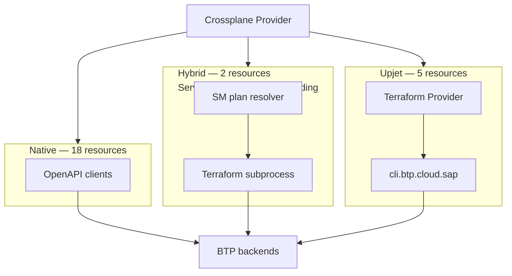

# ADR: Upjet Migration

---

## 1. Current Architecture

crossplane-provider-btp manages 30+ BTP resources inside a single controller-manager pod. Resources are reconciled via three paths:



**Native path (18 resources):** hand-written controllers call BTP REST APIs directly via generated OpenAPI clients. One HTTP call per operation, no subprocess, no disk state. Auth via OAuth2 client credentials (CIS binding).

**Upjet path (5 resources):** upjet drives a Terraform subprocess per reconcile. The subprocess loads the SAP BTP Terraform provider binary, logs in to `cli.btp.cloud.sap` with username/password, and executes the operation. State is written to `terraform.tfstate` on the pod's temp disk.

**Hybrid path (2 resources — ServiceInstance, ServiceBinding):** upjet-generated CRD types with hand-written controllers. A native Service Manager API call resolves the service plan ID on first reconcile; subsequent operations delegate to the upjet subprocess path.

### The 7 upjet resources

| Resource | Async | Native API exists? |
|---|---|---|
| `SubaccountApiCredential` | No | No — CLI server only |
| `SubaccountTrustConfiguration` | No | Yes (XSUAA API) |
| `GlobalAccountTrustConfiguration` | No | Yes (XSUAA API) |
| `DirectoryEntitlement` | No | Yes (Entitlements API) |
| `SubaccountServiceBroker` | No | Partial (SM API, read-only) |
| `SubaccountServiceInstance` | Yes | Yes (SM API) — hybrid |
| `SubaccountServiceBinding` | Yes | Yes (SM API) — hybrid |

### Relationship to the Terraform provider

The SAP Terraform BTP provider (`SAP/terraform-provider-btp`) is not a peer tool — it is a **runtime dependency** of this Crossplane provider. Its binary is bundled in the container image at build time. For resources that have no public REST API (notably `SubaccountApiCredential`), the Terraform provider wraps the BTP CLI server (`cli.btp.cloud.sap`) using an internal `btpcli` HTTP client. There is no REST API underneath — the CLI server is the authoritative interface.

---

## 2. Challenges

### Login / session ratio
Upjet (forked mode) spawns a Terraform subprocess per reconcile loop per resource. Each subprocess performs a fresh login to `cli.btp.cloud.sap` to obtain a session token. With many resources reconciling on short intervals, this generates a disproportionate number of login calls — a ratio problem that grows with the number of managed resources.

### Rate limits
Each Terraform subprocess issues its own sequence of API calls (plan, apply, refresh) through the BTP CLI server, which enforces rate limits. The Crossplane reconcile loop adds continuous pressure on top of what a human operator or CI pipeline would generate.

### Performance
Each reconcile spawns a Terraform subprocess, writes workspace files to disk, and reads back `terraform.tfstate` on completion. State lives in the pod's temp directory and is lost on pod restart — requiring a re-import from BTP on every restart.

### Version coupling
The provider bundles a pinned Terraform binary (~100MB) and the SAP BTP Terraform provider binary. Every BTP Terraform provider release requires a coordinated image update. Breaking changes in the Terraform provider propagate directly into Crossplane behavior. Both providers must be kept in lockstep.

---

## 3. Options

### Option 1 — No-fork upjet *(intermediate — do now)*

Switch the 7 upjet resources from subprocess mode to in-process Go calls using upjet's no-fork architecture (`useTerraformPluginFrameworkClient`). The Terraform binary is removed from the image; the BTP Terraform provider becomes a compile-time Go dependency instead of a runtime binary.

```
Crossplane  →  upjet (in-process)  →  SAP BTP TF provider (Go)  →  cli.btp.cloud.sap  →  BTP
```

**What improves:** No subprocess overhead, no binary bundling in the image.  
**What stays the same:** Login ratio, rate limit pressure, version coupling, CLI server dependency, Terraform state on disk.  
**Effort:** Low — entirely within this repository, no external changes needed. `SAP/terraform-provider-btp` already uses Terraform Plugin Framework v1.19.0 (Protocol v6) — no-fork is compatible today.

---

### Option 2 — All native on OpenAPI

Replace the 7 upjet resources with hand-written controllers backed by the existing OpenAPI REST clients. Crossplane and Terraform operate as independent tools.

```
Crossplane  →  OpenAPI clients  →  BTP REST APIs
Terraform   →  cli.btp.cloud.sap  →  BTP backends    (independent)
```

**What improves:** Crossplane fully decoupled from Terraform — no version coupling, no subprocess, no login ratio problem.  
**Blockers:**
- `SubaccountServiceBroker` — Service Manager OpenAPI spec currently lacks write operations; needs confirmation from the SM team
- `SubaccountApiCredential` — no public REST API exists; the CLI server is the only interface

**Effort:** Medium — 5 of 7 resources unblocked today, 2 require external action.

---

### Option 3 — All native on BTP CLI, side by side *(recommended long-term)*

Both Crossplane and Terraform call the BTP CLI server as independent clients. For resources with no REST API, Crossplane imports the `btpcli` library from `SAP/terraform-provider-btp` directly — no Terraform state machine, no subprocess, no upjet.

```
Crossplane  →  btpcli library (in-process)  →  cli.btp.cloud.sap  →  BTP backends
Terraform   →  btpcli library (in-process)  →  cli.btp.cloud.sap  →  BTP backends
```

Both tools are deployed independently and can target the same or different BTP CLI server instances.

**What improves:** Crossplane eliminates all Terraform and upjet dependencies. Login sessions and API calls are made directly and efficiently. Both tools share the same authoritative interface without duplicating the wire protocol. The two providers can evolve independently.  
**What is required:**
- The `btpcli` library inside `SAP/terraform-provider-btp` is currently `internal/` — it must be exported or published as a standalone Go module
- Alternatively, the BTP CLI team publishes a REST API for `SubaccountApiCredential` management (unblocks Option 2 as well)

**Effort:** Medium — same as Option 2 for the 5 unblocked resources; the 2 blocked resources are unblocked once `btpcli` is accessible.

---

## 4. Per-resource migration path

| Resource | Option 2 | Option 3 | External ask |
|---|---|---|---|
| `SubaccountTrustConfiguration` | ✅ XSUAA API | ✅ XSUAA API | None |
| `GlobalAccountTrustConfiguration` | ✅ XSUAA API | ✅ XSUAA API | None |
| `DirectoryEntitlement` | ✅ Entitlements API | ✅ Entitlements API | None |
| `SubaccountServiceInstance` | ✅ SM API (already hybrid) | ✅ SM API | None |
| `SubaccountServiceBinding` | ✅ SM API (already hybrid) | ✅ SM API | None |
| `SubaccountServiceBroker` | ⚠️ SM write API needed | ⚠️ SM write API needed | SM team: confirm/publish write ops |
| `SubaccountApiCredential` | ❌ no REST API | ✅ btpcli library | BTP CLI team: export `btpcli` |

---

## 5. Recommendation

**Immediate (Option 1):** Migrate to no-fork upjet. Removes the Terraform binary from the image and eliminates subprocess overhead. No external dependencies. Can start today.

**Long-term (Option 3):** Go all native on BTP CLI, side by side with the Terraform provider. Both tools share the CLI server interface without coupling their release cycles. The key external ask is for the BTP CLI team to export the `btpcli` library as a reusable Go module.

Option 2 is a valid stepping stone if the `btpcli` export is delayed — 5 of 7 resources can go native on REST APIs without any external action.
