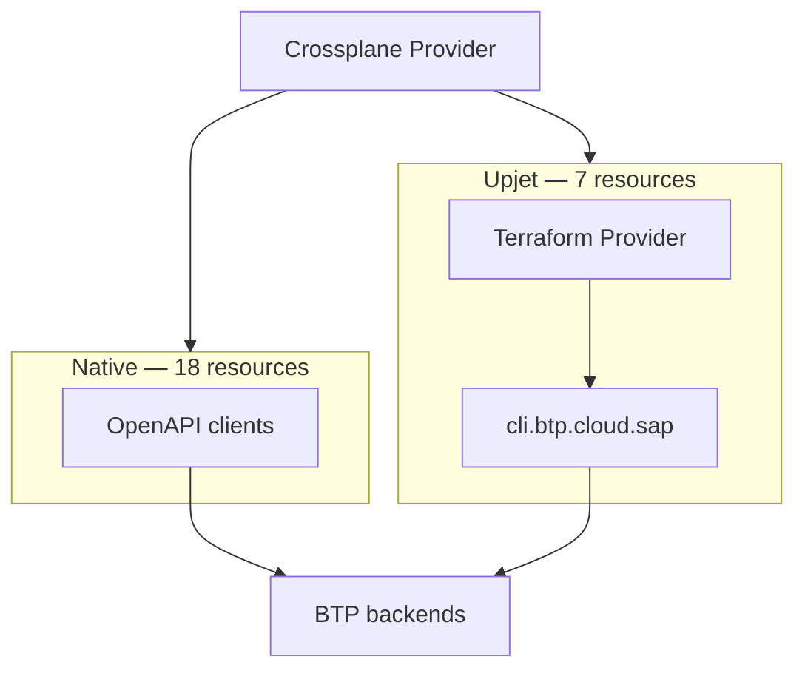

# ADR: Upjet Migration

---

## 1. Current Implemetnation

crossplane-provider-btp manages 30+ BTP resources via two main routes:  



**Native path (18 resources):** hand-written controllers call BTP REST APIs directly via generated OpenAPI clients. One HTTP call per operation, no subprocess, no disk state. Auth via OAuth2 client credentials (CIS binding).

**Upjet path (7 resources):** upjet drives a Terraform subprocess per reconcile. In the current **forked** mode, `SAP/terraform-provider-btp` is a **runtime dependency**: its binary is bundled in the container image and forked as a subprocess on every reconcile.

With **no-fork** (Option 1), this changes: the Terraform provider becomes a **compile-time Go dependency** — imported as a Go module and called in-process. The binary is no longer bundled in the image, but the Go package and its CLI server dependency remain.

With **full native** (Options 2 and 3), the Terraform provider dependency is eliminated entirely from the Crossplane provider.


### The 7 upjet resources

| Resource | Async | Native API exists? |
|---|---|---|
| `SubaccountApiCredential` | No | Not directly |
| `SubaccountTrustConfiguration` | No | Yes (XSUAA API) |
| `GlobalAccountTrustConfiguration` | No | Yes (XSUAA API) |
| `DirectoryEntitlement` | No | Yes (Entitlements API) |
| `SubaccountServiceBroker` | No | Partial (SM API, read-only) |
| `SubaccountServiceInstance` | Yes | Yes (SM API) |
| `SubaccountServiceBinding` | Yes | Yes (SM API) |


## 2. Benefits and Challenges

### Benefits of the upjet approach

**Development (initial) productivity** — upjet generates CRD types and reconciliation scaffolding directly from the Terraform provider schema. Adding a new resource required no REST client implementation, no auth wiring, and no CRUD logic — just configuration.

**Convenience of BTP CLI facade** — the `btpcli` library inside `SAP/terraform-provider-btp` provides a critical abstraction layer that make it much easier to work with XSUAA and authorizations. This also avoid to need to expose lower-level technical resources (e.g., service manger, cloud management apis) to end users.

### Challenges

### Login / session ratio 
Upjet (forked mode) forks a Terraform subprocess per reconcile loop per resource. Each subprocess performs a fresh login to `cli.btp.cloud.sap` to obtain a session token. With many resources reconciling on short intervals, this generates a disproportionate number of login calls — a ratio problem that grows with the number of managed resources. **This may be mitigated by switching to no-fork mode (Option 1)**.

### Rate limits
The workload of crossplane and terraform providers are of different nature and might require different session management and rate limiting policy. Current implementation requires the terraform provider to support a mixture of both workloads, making it difficult to optimize for both.

### Performance
Upjet resources generally have a larger footprint than plain API calls, both in terms of CPU and storage. 

### Version coupling --> maintenance burden
Currently, the provider bundles a pinned Terraform binary (~100MB) and the SAP BTP Terraform provider binary. Every BTP Terraform provider release requires a coordinated image update. Breaking changes in the Terraform provider propagate directly into Crossplane behavior. Both providers must be kept in lockstep.

---

## 3. Options

### Option 1 — No-fork upjet *(intermediate — do now)*

Switch the 7 upjet resources from subprocess mode to in-process Go calls using upjet's no-fork architecture (`useTerraformPluginFrameworkClient`). The Terraform binary is removed from the image; the BTP Terraform provider becomes a compile-time Go dependency instead of a runtime binary.

```
Crossplane  →  upjet (in-process)  →  SAP BTP TF provider (Go)  →  cli.btp.cloud.sap  →  BTP
```

**What improves:** No subprocess overhead, no binary bundling in the image, potentially fewer login calls.
**What stays the same:** Rate limit pressure, version coupling.  

---

### Option 2 — All native on OpenAPI

Replace the 7 upjet resources with hand-written controllers backed by the existing OpenAPI REST clients. Crossplane and Terraform operate as independent tools.

```
Crossplane  →  OpenAPI clients  →  BTP REST APIs
Terraform   →  cli.btp.cloud.sap  →  BTP backends    (independent)
```

**What improves:** Crossplane fully decoupled from Terraform — no version coupling, no subprocess, no login ratio problem.  
**What's worse:**
- Some resources have no direct REST API or only partial support, requires "juggling" to make it work for the user and will introduce breaking changes.
- User experiece degration possible - for they might be required to work with lower-level resources that is not intended for end users (e.g., service manager, cloud management APIs) or user concerns. 

---

### Option 3 — All native on BTP CLI, side by side *(recommended long-term)*

Both Crossplane and Terraform sits side by side on top of the BTP CLI server using the shared client library. 

```
Crossplane  →  btpcli library (in-process)  →  cli.btp.cloud.sap  →  BTP backends
Terraform   →  btpcli library (in-process)  →  cli.btp.cloud.sap  →  BTP backends
```

Both tools are deployed independently and can target the same (or different BTP CLI server instances if required).

**What improves:** Crossplane eliminates all Terraform and upjet dependencies. Login sessions and API calls are made directly and efficiently.  
**What is required:**
- The btp client library used for `SAP/terraform-provider-btp` is shared and can be used by Crossplane provider.  

---

## 5. Recommendation

**Immediate (Option 1):** Migrate to no-fork upjet. Removes the Terraform binary from the image and eliminates subprocess overhead. 

**Long-term (Option 3):** Go all native on BTP CLI, side by side with the Terraform provider. 

