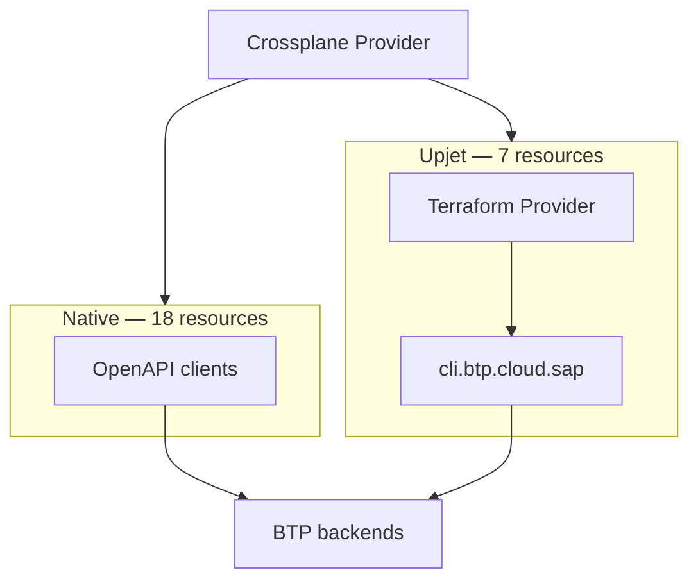

# ADR: Upjet Migration

---

## 1. Current Implementation

crossplane-provider-btp manages 30+ BTP resources via two main routes:



**Native path (18 resources):** Crossplane controllers call BTP REST APIs directly via generated OpenAPI clients. One HTTP call per operation, no subprocess, no disk state. Auth via OAuth2 client credentials (CIS binding).

**Upjet path (7 resources):** upjet controllers fork a Terraform subprocess per reconcile. In the current **forked** mode, `SAP/terraform-provider-btp` is a **runtime dependency**: its binary is bundled in the container image and forked as a subprocess on every reconcile. With **no-fork**, this becomes a **compile-time Go dependency**. The binary is no longer bundled in the image, but the Go package and its CLI server dependency remain.

### The 7 upjet resources

| Resource | Async | Native API exists? |
|---|---|---|
| `SubaccountApiCredential` | No | Not directly |
| `SubaccountTrustConfiguration` | No | Yes (XSUAA API) |
| `GlobalAccountTrustConfiguration` | No | Yes (XSUAA API) |
| `DirectoryEntitlement` | No | Yes (Entitlements API) |
| `SubaccountServiceBroker` | No | Partial (SM API, read-only) |
| `SubaccountServiceInstance` | Yes | Yes (SM API) |
| `SubaccountServiceBinding` | Yes | Yes (SM API) |

---

## 2. Benefits and Challenges

### Benefits of the upjet approach

**Development productivity** — upjet generates CRD types and reconciliation scaffolding directly from the Terraform provider schema. Adding a new resource required no REST client implementation, no auth wiring, and no CRUD logic — just configuration.

**Convenience of BTP CLI facade** — the `btpcli` library inside `SAP/terraform-provider-btp` provides a critical abstraction layer that makes it much easier to work with XSUAA and authorizations. This also avoids exposing lower-level technical resources (e.g., Service Manager, Cloud Management APIs) to end users.

### Challenges

**Login / session ratio**
Upjet (forked mode) forks a Terraform subprocess per reconcile loop per resource. Each subprocess performs a fresh login to `cli.btp.cloud.sap` to obtain a session token. With many resources reconciling on short intervals, this generates a disproportionate number of login calls — a ratio problem that grows with the number of managed resources. This may be mitigated by switching to no-fork mode (Option 1).

**Rate limits**
The workload of Crossplane and Terraform providers are of different nature and may require different session management and rate limiting policies. The current implementation requires the Terraform provider to support a mixture of both workloads, making it difficult to optimize for either.

**Performance**
Upjet resources generally have a larger footprint than plain API calls, both in terms of CPU and storage.

**Version coupling — maintenance burden**
The provider bundles a pinned Terraform binary (~100MB) and the SAP BTP Terraform provider binary. Every BTP Terraform provider release requires a coordinated image update. Breaking changes in the Terraform provider propagate directly into Crossplane behavior. Both providers must be kept in lockstep.

---

## 3. Options

### Option 1 — No-fork upjet *(intermediate — do now)*

Switch the 7 upjet resources from subprocess mode to in-process Go calls using upjet's no-fork architecture (`useTerraformPluginFrameworkClient`). The Terraform binary is removed from the image; the BTP Terraform provider becomes a compile-time Go dependency instead of a runtime binary.

```
Crossplane  →  upjet (in-process)  →  SAP BTP TF provider (Go)  →  cli.btp.cloud.sap  →  BTP
```

**What improves:** No subprocess overhead, no binary bundling in the image, potentially fewer login calls.  
**What stays the same:** Rate limit pressure, version coupling.  
**Effort:** Low — entirely within this repository, no external changes needed. `SAP/terraform-provider-btp` already uses Terraform Plugin Framework v1.19.0 (Protocol v6) — no-fork is compatible today.

---

### Option 2 — All native on OpenAPI

Replace the 7 upjet resources with hand-written controllers backed by the existing OpenAPI REST clients. Crossplane and Terraform operate as independent tools.

```
Crossplane  →  OpenAPI clients  →  BTP REST APIs
Terraform   →  cli.btp.cloud.sap  →  BTP backends    (independent)
```

**What improves:** Crossplane fully decoupled from Terraform — no version coupling, no subprocess, no login ratio problem.  
**What's worse / blockers:**

- Some resources have no direct REST API or only partial support — requires workarounds that may introduce breaking changes
- User experience degradation possible — users may be required to work with lower-level resources not intended for end-user consumption (e.g., Service Manager, Cloud Management APIs)
- `SubaccountServiceBroker` — Service Manager OpenAPI spec currently lacks write operations; needs confirmation from the SM team
- `SubaccountApiCredential` — no public REST API exists; the CLI server is the only interface

**Effort:** Medium — 5 of 7 resources unblocked today, 2 require external action.

---

### Option 3 — All native on BTP CLI, side by side *(recommended long-term)*

Both Crossplane and Terraform sit side by side on top of the BTP CLI server using the shared client library.

```
Crossplane  →  btpcli library (in-process)  →  cli.btp.cloud.sap  →  BTP backends
Terraform   →  btpcli library (in-process)  →  cli.btp.cloud.sap  →  BTP backends
```

Both tools are deployed independently and can target the same or different BTP CLI server instances.

**What improves:** Crossplane eliminates all Terraform and upjet dependencies. Login sessions and API calls are made directly and efficiently. Both tools share the same authoritative interface without duplicating the wire protocol. The two providers can evolve independently.  
**What is required:**

- The `btpcli` library inside `SAP/terraform-provider-btp` is currently `internal/` — it must be exported or published as a standalone Go module for Crossplane to import it
- Alternatively, the BTP CLI team publishes a REST API for `SubaccountApiCredential` management (which would also unblock Option 2)

**Effort:** Medium — same as Option 2 for the 5 unblocked resources; the 2 blocked resources are unblocked once `btpcli` is accessible.

---

## 4. Per-resource migration path

| Resource | Option 2 | Option 3 | External ask |
|---|---|---|---|
| `SubaccountTrustConfiguration` | ✅ XSUAA API | ✅ XSUAA API | None |
| `GlobalAccountTrustConfiguration` | ✅ XSUAA API | ✅ XSUAA API | None |
| `DirectoryEntitlement` | ✅ Entitlements API | ✅ Entitlements API | None |
| `SubaccountServiceInstance` | ✅ SM API (already hybrid) | ✅ SM API | None |
| `SubaccountServiceBinding` | ✅ SM API (already hybrid) | ✅ SM API | None |
| `SubaccountServiceBroker` | ⚠️ SM write API needed | ⚠️ SM write API needed | SM team: confirm/publish write ops |
| `SubaccountApiCredential` | ❌ no REST API | ✅ btpcli library | BTP CLI team: export `btpcli` |

---

## 5. Recommendation

**Immediate (Option 1):** Migrate to no-fork upjet. Removes the Terraform binary from the image and eliminates subprocess overhead. No external dependencies. Can start today.

**Long-term (Option 3):** Go all native on BTP CLI, side by side with the Terraform provider. Both tools share the CLI server interface without coupling their release cycles. The key external ask is for the BTP CLI team to export the `btpcli` library as a reusable Go module.

Option 2 is a valid stepping stone if the `btpcli` export is delayed — 5 of 7 resources can go native on REST APIs without any external action.
