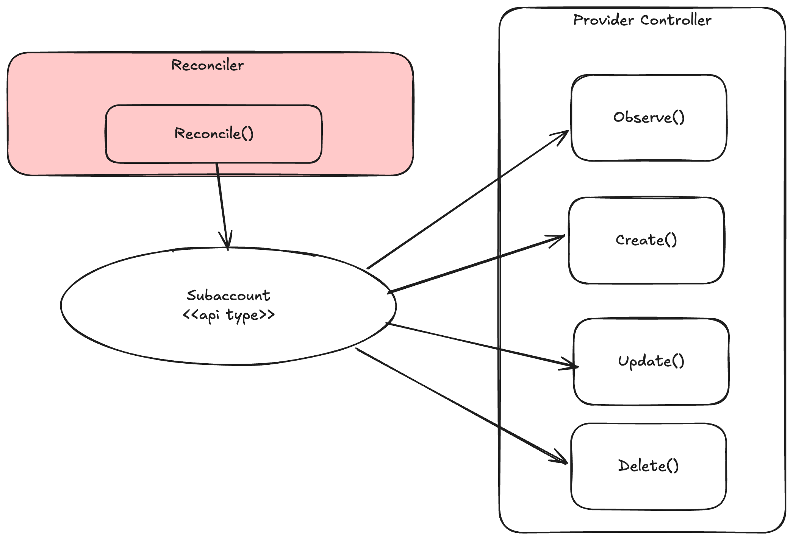
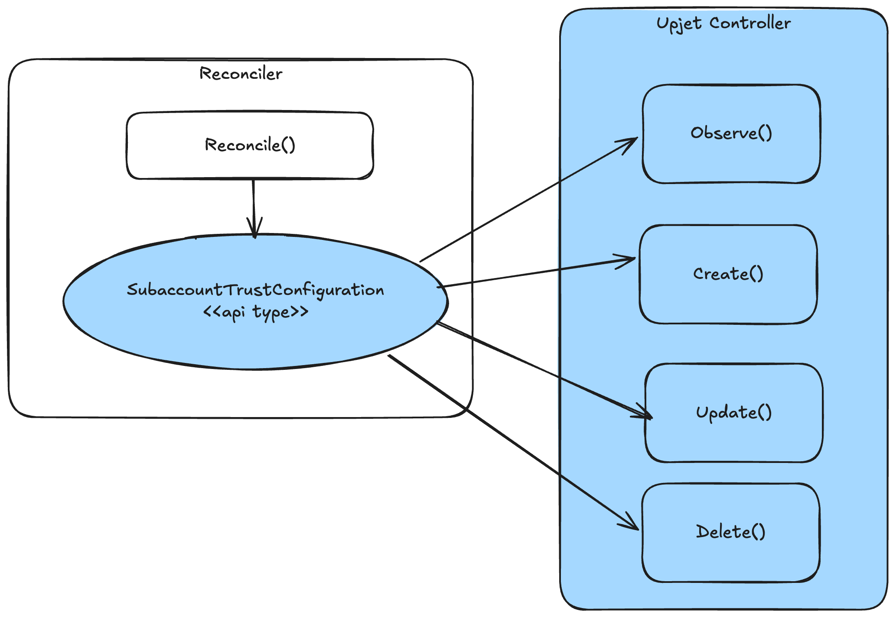
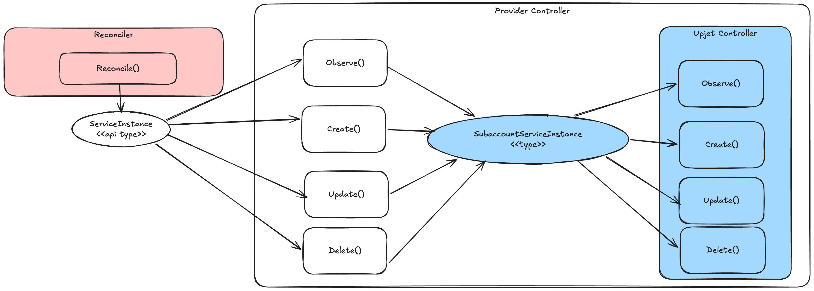

# Resource Implementation Approaches
We generally distinguish between 3 different approaches when imeplementing controller logic for a single resource. 
Next to, what we call "native controllers", you will find another approach based on upjet as well as a hybrid one throughout the provider implementation.
The choice depends on whether a native BTP API exists for the resource and how much custom logic is needed around lifecycle management.
Let's have a closer look at those different approaches.

> **Diagram color coding:** Throughout this document, component colors indicate their origin: **red** = crossplane-runtime, **white** = provider implementation, **blue** = upjet.

## 1. Native Resources
The controller is implemented directly in Go and talks to BTP APIs 

### How it works

The controller is hand-written and owns the full reconciliation logic — it decides what "up to date" means, how to handle drift, and how to map CR fields to API calls.
The API calls themselves are usually done via a generated api client of some sort.

### Resources using this approach

| Resource | Description |
|---|---|
| Directory | BTP account directory |
| Entitlement | Service entitlement on a subaccount |
| Subaccount | BTP subaccount |
| Subscription | SaaS application subscription |
| CloudFoundry Environment | CF environment instance |
| Kyma Environment | Kyma environment instance |
| Kyma Module | Kyma module enablement |
| Kyma Environment Binding | Credentials binding for a Kyma environment |
| Role Collection | Custom role collection |
| Role Collection Assignment | User/group assignment to a role collection |
| Cert Based OIDC Login | Certificate-based OIDC login configuration |
| Kube Config Generator | Kubeconfig generation for cluster access |

---

## 2. Upjet / Terraform-backed Resources

The controller is auto-generated from a Terraform provider schema. No hand-written controller logic exists — upjet handles the full reconciliation by invoking Terraform operations under the hood.

### How it works

The CR schema and the controller are both generated from the Terraform resource schema. This means field names and behaviour closely mirror what the Terraform provider exposes. This approach allows to offload any "real" implementation into the underlying terraform provider. Its generally easy to consume from the crossplane side but does only allow for very little customization in behaviour. 

In case of our Crossplane BTP Provider here we are using the official [BTP Terraform Provider](https://registry.terraform.io/providers/SAP/btp/latest/docs) for those cases. 

Setting up a resource using upjet is quite straight-forward and usually just requires some minimal configuration in the `config` folder of the repository. The generation tools integrated in the provider will take care of autogenerating and wiring types and controller based on those configurations together with the schema data of the provider. 

You can find a more comprehensive tutorial under: 
https://github.com/crossplane/upjet/blob/main/docs/README.md

### Regular vs. no-fork controllers

Upjet supports two modes for invoking Terraform operations, and the generated controller code differs accordingly:

- **Regular (forked):** Each reconciliation schedules a Terraform CLI process in a managed workspace on disk. The controller writes HCL, forks a `terraform` subprocess, and waits for it to finish. This is the older and more resource-intensive mode — it requires a Terraform binary at runtime and carries the overhead of process startup for every operation. The controller is implemented in [`pkg/controller/external.go`](https://github.com/crossplane/upjet/blob/main/pkg/controller/external.go) in upjet.

- **No-fork:** The Terraform provider's Go functions are called directly in-process — no subprocess, no workspace on disk, no Terraform binary required. This is generally the superior approach: it is faster, uses less memory, avoids file system overhead, and makes the provider easier to deploy. The connector is implemented in [`pkg/controller/external_tfpluginfw.go`](https://github.com/crossplane/upjet/blob/main/pkg/controller/external_tfpluginfw.go) (for Plugin Framework-based providers, which the btp provider uses).

> **Note:** The resources in this provider currently still use the regular (forked) mode. Progress on no-fork migration is captured in this [epic](https://github.com/SAP/crossplane-provider-btp/issues/207)

### Resources using the upjet approach

| Resource | Terraform resource backing |
|---|---|
| Directory Entitlement | `btp_directory_entitlement` |
| Global Account Trust Configuration | `btp_globalaccount_trust_configuration` |
| Subaccount API Credential | `btp_subaccount_api_credential` |
| Subaccount Trust Configuration | `btp_subaccount_trust_configuration` |
| Subaccount Service Broker | `btp_subaccount_service_broker` |

---

## 3. Hybrid Resources

The user interacts with a native (meaning developer defined) CR. Internally, the controller maps that CR to an equivalent Terraform-backed type and delegates all infrastructure operations to an embedded upjet controller. The internal Terraform type is never exposed to the user.

This approach is used when a Terraform resource already exists and provides solid infrastructure management, but the user-facing API needs some adaptations or custom behaviour. Such custom behaviour might e.g. be more complex reference resolution, dependency checks or secret handling.

### How it works

> **Note:** In that diagram the blue components are autogenerated via upjet. This case shows the implementation of the ServiceInstance.

The user-facing CRD and its controller are natively implemented. In order to handle all the API-specific aspects it wraps an upjetted controller and delegates the usual CRUD methods (Observe, Create, Update, Delete) to it. In order to do so it defines a mapping between the two CRDs. Results are translated back and written into the native CR's status.

> **Note:** The real implementation is more complex then shown here: whats referred to controller here is actually split into a connector (responsible for setup and mapping) and a controller (responsible for the CRUD calls). Some resources might also use more than one embedded upjet controller internally. There may also be additional initialization steps — for example, resolving a service plan ID before the first reconciliation.

### Key parts of the implementation

The following sections show some of the key aspects of the implementation by using the `ServiceInstance` as the reference example.

#### Setting up the internal Terraform controller

Before any reconciliation can happen, the native connector must construct the internal upjet controller it will delegate to. This involves creating the upjet-compatible connector (backed by a Terraform workspace) and wrapping it together with the mapper into a `TfProxyConnector`.

For `ServiceInstance` this wiring happens in [`newClientCreatorFn`](../../internal/controller/account/serviceinstance/serviceinstance.go#L53) and [`NewServiceInstanceConnector`](../../internal/clients/account/serviceinstance/serviceinstance.go#L22).

#### Mapping

The mapping translates the native `ServiceInstance` CR into the internal `SubaccountServiceInstance` (the upjet type) that the embedded controller actually operates on. This includes copying over field values, merging parameters from secrets, and transferring the external-name annotation so the Terraform workspace can identify the resource. This part is where most of the customization between different resource types comes in. 

The mapping for `ServiceInstance` lives in [`ServiceInstanceMapper.TfResource`](../../internal/clients/account/serviceinstance/serviceinstance.go#L49), with the base resource construction in [`buildBaseTfResource`](../../internal/clients/account/serviceinstance/serviceinstance.go#L94).

#### Delegating CRUD

Once mapping and setup are done, the actual Create / Update / Delete calls are thin delegations to the embedded upjet controller. Observe is slightly richer — it inspects the status returned by the upjet controller and then calls `QueryAsyncData` to extract the current observed state once an async operation has finished.

See [`Observe`](../../internal/controller/account/serviceinstance/serviceinstance.go#L136), [`Create`](../../internal/controller/account/serviceinstance/serviceinstance.go#L221), [`Update`](../../internal/controller/account/serviceinstance/serviceinstance.go#L242), and [`Delete`](../../internal/controller/account/serviceinstance/serviceinstance.go#L258) in the `ServiceInstance` controller.

#### Saving conditions and external name

Terraform operations are often asynchronous. Once an async operation completes, upjet signals this via conditions on the internal resource. The hybrid controller must pick these up and write them back onto the native CR so that Crossplane and users can observe the outcome.

Similarly, the external name is read back from the upjet resource after creation and set on the native CR. Whether this happens after creation directly or in the Observe depends on whether async mode is being used or not. Also there are major differences between using no-fork or not. 

In `ServiceInstance`, the external name and all other observed data is written back in [`saveInstanceData`](../../internal/controller/account/serviceinstance/serviceinstance.go#L280).

## Resources using this approach

| Resource | What the embedded controller manages |
|---|---|
| Service Instance | `btp_subaccount_service_instance` |
| Service Binding | `btp_subaccount_service_binding` |
| Cloud Management | Service instance + binding for the Cloud Management service |
| Service Manager | Service instance + binding for the Service Manager service |
