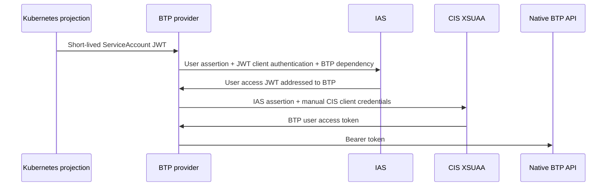

# Configure workload identity authentication

Use workload identity authentication to replace the BTP provider user's long-lived email/password
with a rotating Kubernetes ServiceAccount JWT. IAS maps the workload to a
passwordless user. The provider uses that identity for Terraform/CLI and Cloud
Foundry authentication. Native Cloud Management Service (CIS) calls can use either
an independent service-client token or a federated user token.

**CIS instances and bindings remain manual prerequisites.** Their OAuth client
secrets remain in Kubernetes Secrets. This approach removes the provider user's
password; it does not remove every service credential or provision CIS automatically.
The existing [password-based configuration](./configure-provider-btp.mdx) remains
supported when `workloadIdentity` is absent.

## Choose the native CIS authentication mode

| Mode | Manual CIS binding | Extra IAS consumer | Authorization principal |
|---|---|---|---|
| Service client | `grant_type=client_credentials` | Not required | CIS OAuth client |
| Federated user | `grant_type=user_token` | Required | Mapped IAS/BTP workload user |

For a migration that needs native calls to retain user context, follow the
**federated user** path below. `user_token` is binding metadata: the new provider
path sends an OAuth JWT-bearer grant, while the legacy path sends a password grant.
Changing that metadata manually does not change the binding's allowed grants.



The Terraform/CLI and CF UAA paths use the projected assertion directly through
their respective authentication integrations; they do not send the CIS token to
those login endpoints.

## Prerequisites and values to collect

- A provider version containing the `workloadIdentity` feature and its CRD fields.
  Earlier provider versions may not support these fields; verify the installed CRD.
- A Crossplane control plane whose provider ServiceAccount tokens have an OIDC
  issuer and public HTTPS discovery/JWKS endpoints reachable by IAS.
- A BTP global account and a subaccount for the manual CIS prerequisites.
  CF provisioning requires a local CIS binding in the target subaccount and an
  available, entitled CF landscape.
- An IAS tenant eligible for BTP platform trust, with administrator access.
  An existing dedicated tenant can be reused. If another tenant is needed, use
  your organization's Identity Services onboarding process before proceeding;
  the provider does not create or activate IAS tenants.
- BTP administration rights for trust, role assignments, entitlements and manual
  service instance/binding creation. The CLI steps use `btp` and `kubectl`.
  Python 3 is needed only for the example binding-to-Secret conversion pipelines
  in step 3; it is not a provider runtime requirement.

Use this value map throughout the guide. Uppercase placeholders must be replaced
before applying manifests or running commands.

| Value | Meaning and source |
|---|---|
| `GA_SUBDOMAIN` | Global account subdomain from BTP account overview; not necessarily its UUID |
| `CIS_SUBACCOUNT_ID` | Subaccount UUID holding central CIS; it belongs to the target GA |
| `TARGET_SUBACCOUNT_ID` | Subaccount UUID for CF/local CIS; may equal the central CIS subaccount |
| `BTP_CLI_URL` | CLI server for the BTP landscape, e.g. `https://cli.btp.cloud.sap` |
| `IAS_TENANT_HOST` | Eligible tenant host from `btp list security/available-idp` |
| `IAS_ISSUER` | Exact `issuer` in IAS `/.well-known/openid-configuration` |
| `IAS_TOKEN_BASE_URL` | Host/base URL serving IAS `/oauth2/token`, without that suffix |
| `CLUSTER_ISSUER`, `CLUSTER_JWKS_URI` | Values returned by the cluster discovery document |
| `PROVIDER_NAMESPACE` | Namespace in which Crossplane runs the provider, e.g. `crossplane-system` |
| `SERVICEACCOUNT_NAME` | Explicit provider runtime ServiceAccount name, e.g. `provider-btp` |
| `IDENTITY_SUFFIX` | Fixed suffix used by this guide's example naming scheme, e.g. `workload.example.com` |
| `WORKLOAD_EMAIL` | Chosen IAS/BTP workload email; this guide uses `SERVICEACCOUNT_NAME@PROVIDER_NAMESPACE.IDENTITY_SUFFIX` as an example |
| `BTP_ORIGIN` | Exact BTP platform trust origin, e.g. `workload-platform` |
| `IAS_CONSUMER_CLIENT_ID` | Generated client ID of the confidential consumer created in step 4 |
| `DEPENDENCY_NAME` | Saved consumer dependency name, e.g. `btp-principal-propagation` |

Read both discovery documents and record issuer/JWKS/token endpoint values. An
IAS administration domain alias can differ from its advertised issuer: use
`IAS_ISSUER` for the projected token audience and the token endpoint's base for
`iasUrl`. Preserve exact scheme, path and trailing slash.

## 1. Create the passwordless IAS user and cluster trust

### Create the user and group

1. Sign in to the IAS administration console. Open **Users & Authorizations →
   User Management → Add**.
2. Enter a descriptive name, **Email** = `WORKLOAD_EMAIL` and **Login Name** = the
   same value. Choose **User Type → None** where available and **Account Activation
   → Set status active**. Do not select initial password or activation email.
3. Choose **Add**. Verify the saved user is **Active** and both identifiers match.
   Email verification status can remain unverified for this workload creation
   flow; the live login check below establishes effective platform acceptance.
4. Open **Users & Authorizations → Groups → Create**. Give the group a stable name,
   e.g. `btp-provider-workload`. Enter Name, Display Name and Description, choose
   **Next Step**, leave **Application (Optional)** empty, choose **Next Step →
   Finish**. In the saved group, **User Members → Add**: select the workload user
   by its exact email, choose **Add**, and verify only the intended user is listed.

The email naming scheme in this guide is a proposal, not a required BTP or IAS
format. You can choose another valid email identifier and adjust the NameID
mapping accordingly. What must agree is the mapping result, the IAS user's email
and login name used by this setup, the BTP role assignments, and
`workloadIdentity.userEmail`. Federated CIS tokens must contain that email and the
configured BTP origin.

The example includes the ServiceAccount name, namespace and a fixed suffix to
make the identity readable and distinguish workloads. With this scheme, use a
distinct suffix for each additional trusted cluster; another scheme must likewise
avoid mapping unrelated workloads to the same privileged user. The identifier
needs no inbox for active creation without an activation message.

### Configure the Corporate IdP

1. Open **Identity Providers → Corporate Identity Providers → Create**. Enter a
   descriptive display name, choose **OpenID Connect Compliant**, and create it.
2. Open **Trust → OpenID Connect Configuration**. Set a stable URI-safe internal
   name, enter the cluster discovery URL in **Discovery URL**, and choose **Load**.
3. Verify **Issuer** and **JWKS URI Endpoint** equal the discovery values. Keep an
   appropriate metadata refresh interval (24 hours was used during validation) and Save.
   Reopen the page to verify persistence.
4. For a Kubernetes JWT-only issuer, interactive authorization/token endpoints
   may be absent. IAS can warn that browser SSO is unavailable. Do not add fictitious
   endpoints or a client secret to suppress that warning. The interactive
   **Validate** action is not the workload token-exchange proof.
5. Return to the IdP overview → **Enriched Token Claims → Add**. Set **Claim** to
   `NameID` and **Value** to the following example, substituting your fixed suffix.
   If you chose another email naming scheme, adjust the expression to produce
   that identifier instead:

   ```text
   ${"kubernetes.io".serviceaccount.name}@${"kubernetes.io".namespace}.workload.example.com
   ```

   Preserve the quotes around `kubernetes.io`; it is one dotted JSON property.
   This expression uses the nested claims in a projected Kubernetes token. Its
   result must equal `WORKLOAD_EMAIL`. Save and reopen to verify the exact text.
6. Open **Identity Federation**. Enable **Use Identity Authentication user store**
   and **Allow Identity Authentication users only**. Under **Assigned User Groups**,
   add only the dedicated group. Save and verify both toggles and membership.
   Group restrictions depend on IAS-users-only being enabled.
7. For the JWT-only setup described here, keep **Forward All SSO Requests to Corporate IdP** off and
   **Apply Application Configurations** off. The latter is a choice for this setup;
   review your application policies before production use. Tenant policies can
   still apply. Preserve the human administration login path.

Incoming enriched `NameID` looks up the IAS user. The application's outgoing
subject can remain IAS **User ID** with `mail` from the user's **Email**; it does
not have to equal Kubernetes `sub`. The raw SA subject is used separately for
JWT client authentication in step 4.

This mapping binds by SA **name**, not UID. Restrict who can run workloads as that
SA or request its tokens; recreating the same namespace/SA name retains identity.

## 2. Establish BTP platform trust and roles

Use a human administrator's BTP CLI session for this one-time preparation:

```sh
btp login --url BTP_CLI_URL --sso
btp list security/available-idp --global-account GA_SUBDOMAIN
btp create security/trust --global-account GA_SUBDOMAIN \
  --idp IAS_TENANT_HOST --origin BTP_ORIGIN --name 'Provider workload identity'
btp get security/trust BTP_ORIGIN --global-account GA_SUBDOMAIN
btp get security/trust BTP_ORIGIN --subaccount TARGET_SUBACCOUNT_ID
```

A global-account platform origin must end in `-platform`. Use **platform** trust
for provider/CLI/CF administration, rather than substituting an application-only
subaccount trust. Verify the inherited target-subaccount trust and its CF UAA
origin. The provider uses one `identityProvider` value for BTP and CF; their
origins must agree for CF operation.

Assign the roles required by the intended operations **under that exact origin**.
For the administrative validation, these broad role collections were used:

```sh
btp assign security/role-collection 'Global Account Administrator' \
  --global-account GA_SUBDOMAIN --to-user WORKLOAD_EMAIL --of-idp BTP_ORIGIN
btp assign security/role-collection 'Subaccount Administrator' \
  --subaccount TARGET_SUBACCOUNT_ID --to-user WORKLOAD_EMAIL --of-idp BTP_ORIGIN
btp get security/user WORKLOAD_EMAIL --global-account GA_SUBDOMAIN --of-idp BTP_ORIGIN
btp get security/user WORKLOAD_EMAIL --subaccount TARGET_SUBACCOUNT_ID --of-idp BTP_ORIGIN
```

Choose narrower role collections for the actual supported operation set when
appropriate. Omitting `--of-idp` selects another identity (`sap.default`). BTP role
assignment can create its shadow user; it does not create the IAS user. Authentication
trust and authorization roles are separate prerequisites.

Platform trust creates/inherits the **SAP Business Technology Platform** IAS
application. In IAS open that application → **Trust → Trust Corporate Identity
Providers → Edit**, select the specific cluster IdP checkbox and **Save**. Keep
**Allow logon with all configured corporate identity providers** off. Reopen Edit
and verify the checkbox: seeing an IdP row in the table alone is insufficient.
Keep the inherited subject/attribute mappings unless the platform requires otherwise.

## 3. Manually provision and install CIS credentials

Central CIS is a GA account/entitlement prerequisite shared by the resources using
its ProviderConfig; it is not created once per managed Subaccount. Local CIS is a
separate prerequisite for native environment APIs in the target subaccount/region.
Central and local bindings cannot be substituted for each other.

Assign the required plans first, if not already entitled:

```sh
btp assign accounts/entitlement --for-service cis --plan central \
  --enable true --to-subaccount CIS_SUBACCOUNT_ID
btp assign accounts/entitlement --for-service cis --plan local \
  --enable true --to-subaccount TARGET_SUBACCOUNT_ID
```

Verify assignment completion before creating instances. For **federated user** mode,
create Other-environment instances through BTP CLI/Service Manager without the
`grantType=clientCredentials` override:

```sh
btp create services/instance --subaccount CIS_SUBACCOUNT_ID \
  --offering-name cis --plan-name central --name manual-cis-central
btp create services/binding --subaccount CIS_SUBACCOUNT_ID \
  --instance-name manual-cis-central --name manual-cis-central-binding \
  --parameters '{"credential-type":"binding-secret"}'
btp create services/instance --subaccount TARGET_SUBACCOUNT_ID \
  --offering-name cis --plan-name local --name manual-cis-local
btp create services/binding --subaccount TARGET_SUBACCOUNT_ID \
  --instance-name manual-cis-local --name manual-cis-local-binding \
  --parameters '{"credential-type":"binding-secret"}'
```

Get each binding explicitly; the creation response may omit `credentials`. Verify
`grant_type=user_token` and `uaa.credential-type=binding-secret`. Keep the complete
credential JSON and its original tenant-specific endpoints. Native X.509 binding
credentials are not supported by this authentication path.

For **service-client** mode, add `--parameters '{"grantType":"clientCredentials"}'`
when creating each instance and expect `grant_type=client_credentials`. Use either
this mode or the user mode intentionally; do not modify the returned binding JSON
as a way of switching modes.

Install the credential JSON in a namespace the runtime can read. In the examples
this is `crossplane-system`; substitute an allowed namespace if required. The
central key is selectable in ProviderConfig; the environment's local key must be
`__raw`. The following Bash pipelines avoid a local credential file and do not
print the binding. Set non-secret routing values first:

```sh
export KUBECONFIG_PATH='/path/to/kubeconfig'
export CIS_SUBACCOUNT_ID='REPLACE_WITH_CENTRAL_SUBACCOUNT_UUID'
export TARGET_SUBACCOUNT_ID='REPLACE_WITH_LOCAL_SUBACCOUNT_UUID'
export CIS_SECRET_NAMESPACE='crossplane-system'
export EXPECTED_CIS_GRANT='user_token' # or client_credentials for service-client mode
set -o pipefail

btp --format json get services/binding --name manual-cis-central-binding \
  --subaccount "$CIS_SUBACCOUNT_ID" | python3 -c '
import base64, json, os, sys
credentials = json.load(sys.stdin)["credentials"]
if (credentials.get("grant_type") != os.environ["EXPECTED_CIS_GRANT"] or
    not credentials.get("uaa", {}).get("clientsecret") or
    credentials.get("uaa", {}).get("credential-type") != "binding-secret"):
    sys.exit("Unexpected CIS binding type or missing client secret")
secret = {"apiVersion": "v1", "kind": "Secret",
          "metadata": {"name": "manual-cis-central", "namespace": os.environ["CIS_SECRET_NAMESPACE"]},
          "type": "Opaque", "data": {"credentials": base64.b64encode(json.dumps(credentials).encode()).decode()}}
json.dump(secret, sys.stdout)
' | kubectl --kubeconfig "$KUBECONFIG_PATH" create -f -

btp --format json get services/binding --name manual-cis-local-binding \
  --subaccount "$TARGET_SUBACCOUNT_ID" | python3 -c '
import base64, json, os, sys
credentials = json.load(sys.stdin)["credentials"]
if (credentials.get("grant_type") != os.environ["EXPECTED_CIS_GRANT"] or
    not credentials.get("uaa", {}).get("clientsecret") or
    credentials.get("uaa", {}).get("credential-type") != "binding-secret"):
    sys.exit("Unexpected CIS binding type or missing client secret")
secret = {"apiVersion": "v1", "kind": "Secret",
          "metadata": {"name": "manual-cis-local", "namespace": os.environ["CIS_SECRET_NAMESPACE"]},
          "type": "Opaque", "data": {"__raw": base64.b64encode(json.dumps(credentials).encode()).decode()}}
json.dump(secret, sys.stdout)
' | kubectl --kubeconfig "$KUBECONFIG_PATH" create -f -
```

These commands create new Secrets; for credential rotation use your normal Secret
management process. Keep credential values out of Git, command arguments and
client-side last-applied annotations. CIS Secret creation/rotation remains manual.

## 4. Configure the IAS consumer for federated native user calls

Skip this entire step for native service-client mode. CLI/CF assertion login uses
the BTP integration; native user-preserving CIS additionally needs this consumer.

1. **Applications & Resources → Applications → Create**: create a dedicated
   **OpenID Connect** consumer, e.g. *BTP provider workload CIS exchange*. A custom
   application may be classified as a charged application by IAS; use an entitled
   tenant. Redirect/Home URLs are unnecessary for this bearer flow.
2. **Trust → OpenID Connect Configuration → Configure → Add Name**: choose a
   stable name, e.g. `btp-provider-workload-cis-exchange`, and save it.
3. **OpenID Connect Configuration → Authentication → Grant Types → Edit**:
   enable **JWT Bearer** and Save. Disable unused password, authorization-code,
   implicit and refresh grants. **Client Credentials** can be enabled for a
   separate JWT client-authentication diagnostic; the implemented user flow uses
   JWT Bearer. RFC 8693 is not required for this path.
4. **Trust → Client Authentication → JSON Web Tokens → Configure Trust by Issuer
   → Add → Manual Configuration**: configure the following and Save:

   | Field | Value |
   |---|---|
   | Issuer | `CLUSTER_ISSUER` |
   | JSON Web Key Set URI | `CLUSTER_JWKS_URI` (use Check for Metadata, then verify) |
   | Subject | `system:serviceaccount:PROVIDER_NAMESPACE:SERVICEACCOUNT_NAME` |
   | Audience | `IAS_ISSUER`, equal to the projected JWT audience |
   | Refresh Interval | Appropriate JWKS refresh interval; 24 hours used during validation |

   Save both the dialog and parent editor where offered. Leave **Enable Public
   Client Flows** disabled. No IAS client secret or private signing key is needed:
   IAS authenticates this confidential client using the projected JWT.
5. In this **consumer** application, separately open **Trust → Trust Corporate
   Identity Providers → Edit**. Select the specific cluster IdP, Save, and reopen
   Edit to verify it is checked. Keep allow-all disabled. This is distinct from
   client JWT trust and from the BTP application's user trust in step 2.
6. **Trust → Dependencies → APIs → Add**: set **Dependency Name** to
   `btp-principal-propagation`, choose **Application → SAP Business Technology
   Platform**, then its advertised **All APIs / Allow all APIs for principal
   propagation** entry. Select dropdown entries; typing a string alone may leave
   an invalid field. Save and verify the dependency appears after reopening.
7. Record the generated **Client ID** from Client Authentication. Use that consumer
   ID as `iasClientId`, not the BTP application's client ID or its display name.
   `iasResource` names the saved dependency:

   ```text
   urn:sap:identity:application:provider:name:btp-principal-propagation
   ```

Review the consumer's token/session policy for your deployment. The proof used
short-lived projected JWTs and in-memory tokens; a 15-minute local session replacement
is not an IAS server-side reauthentication/revocation guarantee.

The provider sends the same projected JWT as `assertion` and `client_assertion` to
IAS, using JWT-bearer grant and JWT client assertion type. It requests `openid email
profile`, `token_format=jwt`, and the dependency resource. IAS returns a user
**access token** whose audience is the BTP application and whose `ias_apis` includes
`principal-propagation`. The provider exchanges this access JWT at the ordinary
CIS binding's XSUAA `/oauth/token` endpoint using its manual client ID/secret. It
checks IAS `mail` and CIS `user_name`/`origin` against configured identity.

Requesting a token for the consumer alone is insufficient: XSUAA expects the
BTP application in its audience. This flow does not require platform master
client credentials or forwarding the raw Kubernetes JWT to CIS XSUAA.

## 5. Configure the runtime and ProviderConfig

Save the following runtime configuration, substituting the exact IAS issuer and
SA name. Apply it before selecting workload authentication:

```yaml
apiVersion: pkg.crossplane.io/v1beta1
kind: DeploymentRuntimeConfig
metadata:
  name: provider-btp-workload
spec:
  serviceAccountTemplate:
    metadata:
      name: provider-btp
  deploymentTemplate:
    spec:
      selector: {}
      template:
        spec:
          containers:
            - name: package-runtime
              volumeMounts:
                - name: workload-assertion
                  mountPath: /var/run/secrets/workload
                  readOnly: true
          volumes:
            - name: workload-assertion
              projected:
                sources:
                  - serviceAccountToken:
                      audience: IAS_ISSUER
                      expirationSeconds: 600
                      path: token
---
apiVersion: pkg.crossplane.io/v1
kind: Provider
metadata:
  name: provider-btp
spec:
  package: ghcr.io/sap/crossplane-provider-btp/crossplane/provider-btp:WORKLOAD_IDENTITY_VERSION
  runtimeConfigRef:
    name: provider-btp-workload
```

`serviceAccountTemplate` fixes the SA name; the actual namespace comes from the
provider deployment. It must match the IAS user mapping and client subject. Mount
without `subPath` so kubelet projection rotation stays visible. Preserve other
runtime settings and the Kubernetes API credential when adapting an existing
managed installation; modify its owning configuration if another operator manages it.
For a self-managed installation, save the block as `runtime-workload.yaml` and run:

```sh
kubectl --kubeconfig "$KUBECONFIG_PATH" apply -f runtime-workload.yaml
kubectl --kubeconfig "$KUBECONFIG_PATH" get provider provider-btp
kubectl --kubeconfig "$KUBECONFIG_PATH" get pods -n PROVIDER_NAMESPACE \
  -l pkg.crossplane.io/provider=provider-btp
```

Wait for the selected Provider revision and runtime pod to become healthy. Verify
its ServiceAccount and mounted volume are the intended ones before creating test CRs.

Save this **federated user** ProviderConfig as `providerconfig-workload.yaml`:

```yaml
apiVersion: btp.sap.crossplane.io/v1alpha1
kind: ProviderConfig
metadata:
  name: workload
spec:
  globalAccount: GA_SUBDOMAIN
  cliServerUrl: BTP_CLI_URL
  cisCredentials:
    source: Secret
    secretRef:
      namespace: crossplane-system
      name: manual-cis-central
      key: credentials
  workloadIdentity:
    tokenFile: /var/run/secrets/workload/token
    identityProvider: BTP_ORIGIN
    userEmail: WORKLOAD_EMAIL
    iasUrl: IAS_TOKEN_BASE_URL
    iasClientId: IAS_CONSUMER_CLIENT_ID
    iasResource: urn:sap:identity:application:provider:name:btp-principal-propagation
```

Use the Secret namespace from step 3. All three IAS fields must be provided together.
For **service-client** native mode, use `client_credentials` CIS bindings and omit
all three IAS fields together. Both modes keep `tokenFile`, `identityProvider` and
`userEmail` for CLI/CF. Omit `serviceAccountSecret`: workload mode rejects mixed
password credential inputs. Never put the JWT itself in a CR or Secret.

Apply the configuration after substituting the placeholders:

```sh
kubectl --kubeconfig "$KUBECONFIG_PATH" apply -f providerconfig-workload.yaml
```

For migration, create a separate ProviderConfig and validate disposable resources
before switching existing resources' references. Retain old credentials/configuration
for rollback. Removing `workloadIdentity` alone is not a rollback: the legacy
`serviceAccountSecret` reference must also be restored. Existing CIS user-token
bindings can be retained if compatible with this exchange; validate their actual
plan/tenant/grant configuration before migrating.

## 6. Verify with disposable resources

Use a unique subdomain/org name and an entitled region/landscape. Start with a
Subaccount so central native authorization can be checked independently:

```yaml
apiVersion: account.btp.sap.crossplane.io/v1alpha1
kind: Subaccount
metadata:
  name: workload-subaccount-proof
spec:
  providerConfigRef:
    name: workload
  forProvider:
    displayName: Workload identity proof
    description: Disposable workload identity validation
    region: BTP_REGION
    subdomain: UNIQUE_SUBDOMAIN
    usedForProduction: NOT_USED_FOR_PRODUCTION
    subaccountAdmins:
      - WORKLOAD_EMAIL
```

For CF, first assign the `cloudfoundry/standard` quota using the BTP cockpit's
Entitlements page or your existing entitlement process. Select an active landscape
with `btp list accounts/available-environment --subaccount TARGET_SUBACCOUNT_ID`. Use the manual local binding in that **same target**
subaccount. A zero-memory org requires no apps/spaces for this check:

```yaml
apiVersion: environment.btp.sap.crossplane.io/v1alpha1
kind: CloudFoundryEnvironment
metadata:
  name: workload-cf-proof
spec:
  providerConfigRef:
    name: workload
  subaccountGuid: TARGET_SUBACCOUNT_ID
  cloudManagemxentSecret: manual-cis-local
  cloudManagementSecretNamespace: crossplane-system
  cloudManagementSubaccountGuid: TARGET_SUBACCOUNT_ID
  forProvider:
    landscape: ACTIVE_CF_LANDSCAPE
    orgName: UNIQUE_CF_ORG_NAME
    environmentName: workload-cf-proof
    initialOrgManagers:
      - TEST_MANAGER_EMAIL|TEST_MANAGER_ORIGIN
```

`cloudManagemxentSecret` is the current API's historical spelling, including `x`.
The provider sets the workload email and origin during native CF creation to
bootstrap its Org Manager, then uses CF JWT authentication to add/read initial
managers. Verify the workload and optional test manager have the intended origins;
do not manually assign the workload role and then count that as automatic bootstrap.
`initialOrgManagers` is immutable; CF Update remains the existing no-op.

Save the examples as `subaccount-workload-proof.yaml` and `cf-workload-proof.yaml`.
For the Subaccount test:

```sh
kubectl --kubeconfig "$KUBECONFIG_PATH" apply -f subaccount-workload-proof.yaml
kubectl --kubeconfig "$KUBECONFIG_PATH" wait \
  --for=condition=Ready subaccount/workload-subaccount-proof --timeout=10m
kubectl --kubeconfig "$KUBECONFIG_PATH" get subaccount workload-subaccount-proof
```

Apply the CF manifest separately and check its Ready/Synced conditions and
`status.atProvider.managers`. Tests can finish asynchronously; an API accepting
creation is not the same as a Ready resource.

1. Apply the manifests with the intended kubeconfig and wait for `Ready=True` and
   `Synced=True`. Record external IDs. For federated user mode, verify BTP
   Subaccount `createdBy`/`lastModifiedBy` and CF manager identity/origin.
2. Update the disposable Subaccount's display name and verify it independently
   through BTP CLI/cockpit. The workload identity should remain the modifier.
3. After creation completes, leave the provider running for more than 15 minutes.
   Logs record successful native/CF logins with JWT `iat`/`exp`, not token values.
   Confirm newer projection timestamps after original JWT expiry, a safe update/read
   afterward, and an unchanged pod/restart count. Restart is a separate cold-start
   test; it is not evidence of uninterrupted renewal.
4. Delete the test CRs. Wait for normal finalization and independently confirm
   Subaccount absence and `btp list accounts/environment-instance` absence. Keep
   manual CIS bindings/Secrets until deletion finishes. Avoid manually removing
   finalizers or deleting the backend while counting provider cleanup as passed.

For the disposable examples, cleanup commands are:

```sh
kubectl --kubeconfig "$KUBECONFIG_PATH" delete cloudfoundryenvironment workload-cf-proof
kubectl --kubeconfig "$KUBECONFIG_PATH" delete subaccount workload-subaccount-proof
kubectl --kubeconfig "$KUBECONFIG_PATH" wait \
  --for=delete cloudfoundryenvironment/workload-cf-proof --timeout=10m
kubectl --kubeconfig "$KUBECONFIG_PATH" wait \
  --for=delete subaccount/workload-subaccount-proof --timeout=10m
```

Retain the manual IAS/CIS prerequisites for reuse. If eventually removing the
setup, complete all managed deletion first, then remove obsolete Kubernetes
Secrets, service bindings/instances and the dedicated IAS consumer through their
own administration processes.

## Troubleshooting

| Symptom | Check |
|---|---|
| Workload fields rejected/pruned | Installed version and ProviderConfig CRD contain the feature |
| Cannot read assertion / expired claims | Token mount/path, SA identity, kubelet rotation and clock |
| IAS client authentication fails | Exact issuer/JWKS/subject/audience in consumer JWT client trust; confidential client ID |
| `Invalid trust configured for token issuer` | Consumer's Corporate IdP checkbox is actually selected and saved; client auth may succeed independently |
| XSUAA says parties are missing from audience | Saved BTP dependency and `iasResource`; use IAS access JWT addressed to BTP |
| Provider rejects email/origin mismatch | IAS NameID lookup, user mail mapping, configured email and exact BTP origin |
| Native API 401/403 | Binding central/local plan, token tenant/audience, user's target roles; token issuance alone is not authorization proof |
| CF login succeeds but manager calls fail | Correct CF org roles/origin; GA roles alone do not grant CF org membership |
| ServiceInstance plan lookup fails | Service Manager credential is still required for name-based resolution; a pre-resolved plan ID skips lookup |

## Validation scope and limits

Live validation covered native central/local CIS user exchange, Subaccount create/update/
delete with workload audit identity, CF controller create/automatic manager
bootstrap/observe/delete, and SI/SB coexistence. Native and CF reauthentication
from a rotated projection after original JWT expiry and 15-minute local session
replacement was verified in one uninterrupted process. Password-path tests and
focused race tests passed.

These results do not establish full production or migration parity. Live legacy
password regression, same-principal allow/deny audit comparison, long-duration
server token expiry/revocation, interrupted-create recovery, and Kyma lifecycle
coverage remain separate checks. Native Subscription currently uses a separate
service-client token source; this user-preserving exchange is not integrated there.
Service-specific credentials and manual CIS secret rotation remain.

## Reference documentation

- [BTP platform trust and federation](https://help.sap.com/docs/btp/sap-business-technology-platform/trust-and-federation-with-identity-providers)
- [CIS service plans](https://help.sap.com/docs/btp/sap-business-technology-platform/a508b724bf6d457ca7ac024b8e4b8457.html)
- [IAS NameID claim enrichment](https://help.sap.com/docs/identity-authentication/identity-authentication/enrich-token-claims-coming-from-corporate-idp)
- [IAS JWT client authentication](https://help.sap.com/docs/cloud-identity-services/cloud-identity-services/auth-configure-jwt-for-oauth-client-authentication?locale=en-US)
- [IAS API consumption and dependencies](https://help.sap.com/docs/cloud-identity-services/cloud-identity-services/consume-api-from-provider-application)
- [Contributor authentication and cache notes](../../contribution-notes/workload-identity.md)
