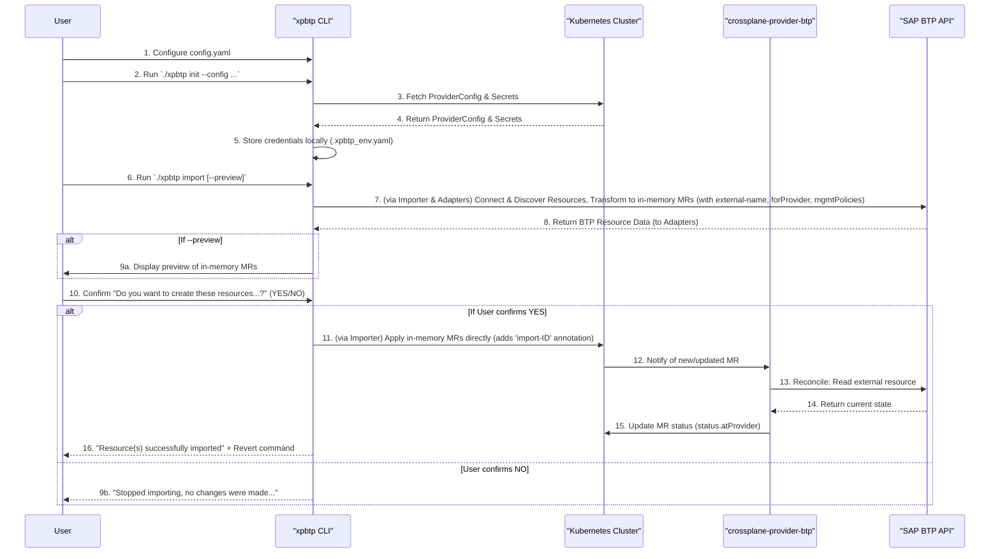

# Comprehensive Understanding of the `xpbtp` CLI Tool

## 1. Core Crossplane Concepts Leveraged

*   **Control Plane Extension**: Crossplane extends Kubernetes to manage external cloud resources.
*   **Providers (crossplane-provider-btp)**: This provider enables Crossplane to interact with SAP BTP. It defines:
    *   **Managed Resources (MRs)**: Kubernetes CRs representing BTP resources (e.g., Subaccount, Directory, Entitlement from [apis/account/v1alpha1/](apis/account/v1alpha1/)).
    *   **ProviderConfig**: A Kubernetes CR storing BTP credentials and connection configuration.
*   **Import Mechanism**:
    *   `crossplane.io/external-name: "<external-resource-id>"` annotation in MR metadata links to existing BTP resources.
    *   `spec.managementPolicies: ["Observe"]` (typically) for initial non-intrusive import, populating `status.atProvider`.
    *   `spec.deletionPolicy: "Orphan"` as a safe default for imported resources.

## 2. xpbtp CLI Tool Workflow

### A. Initialization (./xpbtp init)

1. Reads CLI config ([internal/cli/config.yaml](internal/cli/config.yaml)) for the ProviderConfig name.
2. Connects to Kubernetes, fetches the specified BTP ProviderConfig and its secrets.
3. Stores BTP credentials locally (e.g., in [internal/cli/.xpbtp_env.yaml](internal/cli/.xpbtp_env.yaml)).

### B. Import Process (./xpbtp import)

1. A unique **Transaction ID** is generated for the import run.
2. Uses stored BTP credentials (from init phase).
3. **Resource Discovery & Transformation** (within internal/crossplaneimport/importer/importer.go calling ResourceAdapters like [internal/cli/adapters/v1alpha1/subaccount.go](internal/cli/adapters/v1alpha1/subaccount.go)):
   * Connects to SAP BTP API.
   * Filters and fetches existing BTP resources (Subaccounts, Directories, Entitlements) based on [internal/cli/config.yaml](internal/cli/config.yaml).
   * For each BTP resource, the respective adapter:
     * Constructs an in-memory Crossplane Managed Resource object.
     * Sets `metadata.annotations` including `crossplane.io/external-name` (using BTP resource's GUID/unique ID).
     * Populates `spec.forProvider` with fields mapped from the BTP API response (e.g., `displayName`, `region`; some complex fields like `SubaccountAdmins` might be initialized to defaults or require further handling).
     * Sets `spec.managementPolicies` based on config.yaml.
     * Sets `spec.providerConfigRef` to point to the configured ProviderConfig.
     * Sets `spec.deletionPolicy` (e.g., to Orphan).
4. **Preview (if --preview flag is used)**: Displays a summary of the in-memory MRs that would be created.
5. **User Confirmation**: Prompts the user "Do you want to create these resources...? [YES|NO]".
6. **Resource Creation in Kubernetes (if user confirms YES)** (within internal/crossplaneimport/importer/importer.go):
   * Adds an `import-ID: "<transactionID>"` annotation to each in-memory MR object.
   * Directly applies/creates these MR objects in the Kubernetes cluster using a Kubernetes client.
   * **Note**: The tool does *not* primarily save these as YAML files to an output directory for manual application; it applies them directly.
7. **Post-Application**:
   * The crossplane-provider-btp (running in K8s) detects the new MRs.
   * It reconciles them, matching with existing BTP resources via external-name, and populates `status.atProvider`.
   * The CLI informs the user of success and provides a `kubectl delete ... -l import-ID=<transactionID>` command for potential rollback.

## 3. Visual Workflow
